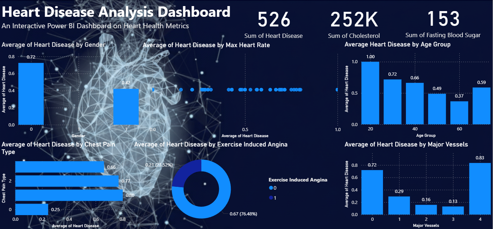
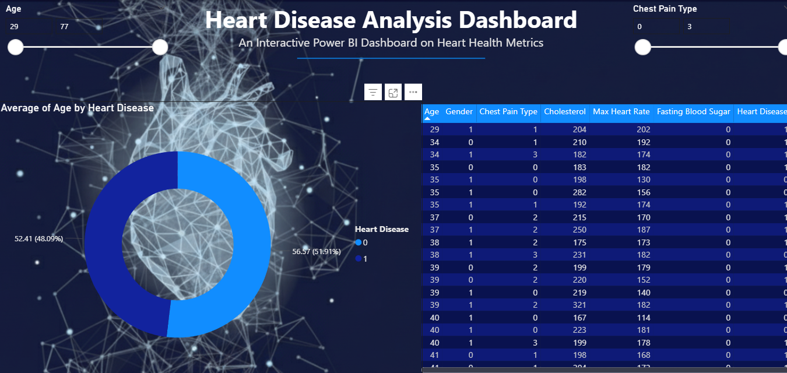

# ❤️ Heart Disease Analysis Dashboard

An interactive **Power BI dashboard** created to analyze heart disease patterns and health metrics.
This project demonstrates how data visualization can help understand key health indicators related to heart disease.

---
## Dashboard Preview





## 📁 Project Structure

```
heart_dashboard
│
├── images
│   └── dashboard_preview.png
│
├── heart_disease_dashboard.pbix
├── heart_disease_dataset.csv
└── README.md
```

---

## 📂 Dataset

The dataset contains medical attributes used to analyze heart disease patterns.

Main features include:

* Age
* Gender
* Chest Pain Type
* Cholesterol
* Maximum Heart Rate
* Fasting Blood Sugar
* Exercise Induced Angina
* Major Vessels
* Heart Disease (Target variable)

---

## 📈 Dashboard Insights

The dashboard provides insights such as:

* Distribution of heart disease by **age group**
* Impact of **gender on heart disease**
* Relationship between **maximum heart rate and heart disease**
* Analysis of **chest pain types**
* Influence of **major vessels on heart disease**
* Key health indicators summarized using **KPI cards**

---

## 🛠 Tools & Technologies Used

* **Power BI**
* **Data Visualization**
* **Data Analysis**
* **CSV Dataset**

---

## 🎯 Project Objectives

* Understand factors influencing heart disease
* Build an interactive health analytics dashboard
* Practice data storytelling using Power BI
* Demonstrate data visualization skills for portfolio

---

## 🚀 How to Use

1. Download the repository
2. Open the `.pbix` file using **Power BI Desktop**
3. Explore the interactive dashboard

---

## 📌 Author

DineshPrabhu 
Aspiring **Data Analyst / Data Scientist**
